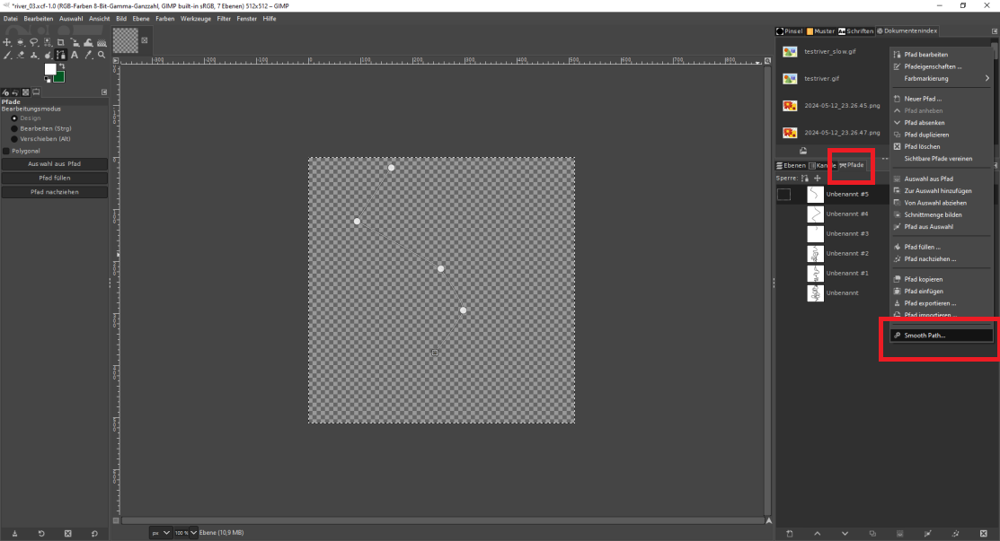

# Smooth Path GIMP plug-in (25/10/2009) v1.11
===========================================

The Path tool in the GIMP allows you to specify paths with anchor 
points that are then joined together with discrete Bezier curves. To 
make these curves join together smoothly, you need to manipulate the 
control points manually, which can be an exercise in tedium and 
frustration. This plugin carries out this process automatically, using
a Bezier interpolation algorithm (details of which may be found here: 
http://www.math.ucla.edu/~baker/java/hoefer/Spline.htm).

## How to install:
---------------

Linux: At the command-line use "gimptool-2.0 --install smooth-path.c".
Windows: Move the included smooth-path.exe file to your plugins folder.

Verify installation:
help > plugin browser > search for "smooth-path"

## How to use:
-----------

* Select Path tool, and add your anchor points.
* In the Paths dialog, choose right-click menu option, Smooth Path...
* In the Smooth Path dialog window choose your settings  and click OK.
* Path has been smoothed according to the settings.

## Smooth Path dialog window settings:
-----------------------------------

1) Smooth only specified corners: If On, only corners whose interior
   angles lie between the two settings below will be smoothed. [On/Off]

2) Minimum angle (degrees): Corners blunter (greater) than this angle
   will be smoothed. [0.00 .. 180.00]

3) Maximum angle (degrees): Corners sharper (less) than this angle will 
   be smoothed. [0.00 .. 180.00]

Note: You can set the minimum angle higher than the maximum angle. In
      this case settings 2 and 3 still apply as described, but with 
      OR logic instead of AND logic.

Changes:
--------

v1.0  Released
v1.1  Made some changes to the options
v1.11 Bug fix, no error on Ctl-F

Screenshots:
------------

http://www.ludicity.org/images/smooth_demo.png
http://www.ludicity.org/images/smooth_settings.png

## Author:
-------

Marko Peric (G00g1e em4i1 account name is cragwolf).

## Contributors:
-------------

Rob Antonishen <http://ffaat.pointclark.net>

## Note:  
This is a reupload by IR0NSIGHT, since the original links are all dead  
All credit goes to the author.  